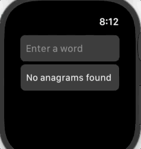

# Anagram

This is the sample project for the [Learn Swift LA](https://www.meetup.com/LearnSwiftLA/) / RSVP [Swift Coders LA](https://www.meetup.com/SwiftCoders-L-A/) meetup on 2/3/2021.
See the [meetup notes](https://github.com/joshuajhomann/Learn-Swift-LA-Meeting-Notes/edit/main/README.md) for details.

This project demonstrates:
  * Making a basic cross platform (iOS and watchOS) app by using Swift Package Manager to create a complex dependency graph with local and remote packages
  * The UI for the app is contained in the `AnagramUI` package which is the only package that is imported by the watchOS and iOS targets.
  * The logic for the app is contained in the `AnagramLogic` package which is imported by `AnagramUI`.  `AnagramLogic` imports the third party `PrefixTrie` package that we created at the beginning of the meetup as well as Apple's `Algorithms` package, which itself imports Appl's `Numerics` package.

  